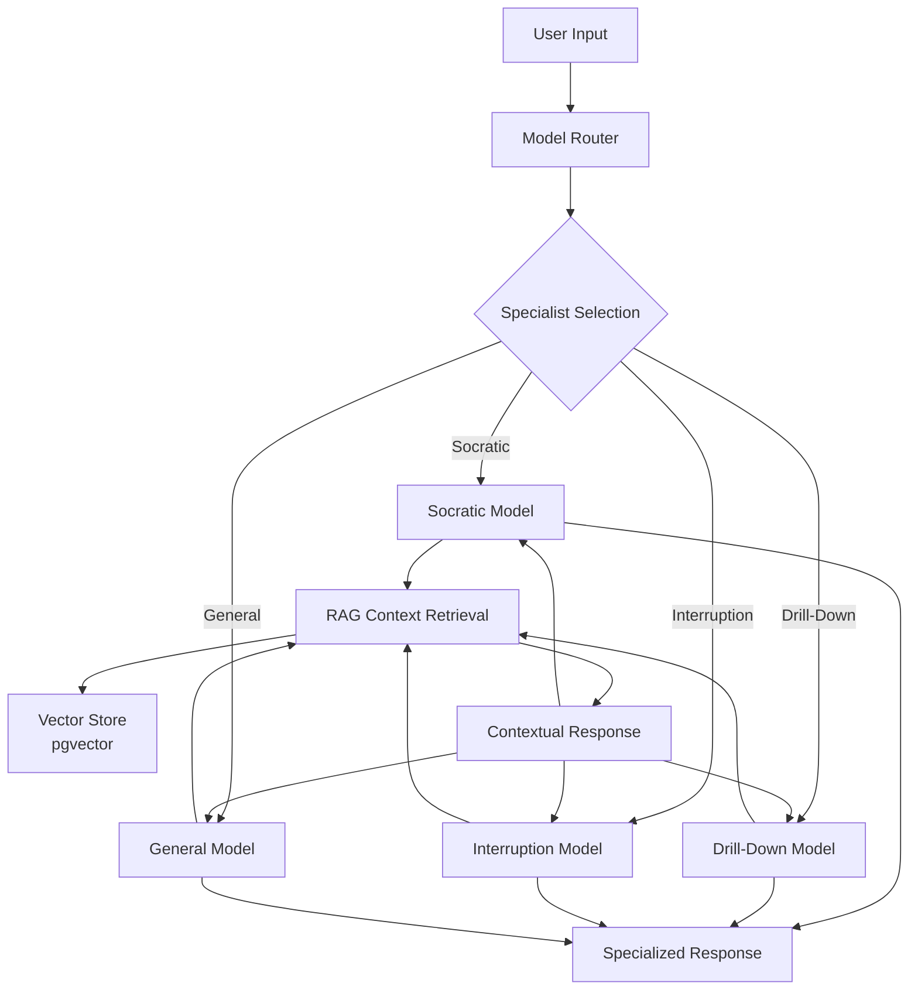

# ZenGlow AI Workspace - Architecture Overview
*Last Updated: August 29, 2025*

## Project Structure

```
ZenGlowAIWorkspace/
├── 🎯 Core Application
│   ├── app/                     # Main FastAPI application
│   │   ├── core/               # Core services (config, metrics, cache)
│   │   ├── rag/                # RAG pipeline & retrieval
│   │   ├── leonardo/           # Voice-enabled Leonardo assistant
│   │   ├── audio/              # TTS/STT integration
│   │   └── health/             # Health monitoring
│   │
├── 🧠 Fine-Tuning Infrastructure
│   ├── fine_tuning/            # Specialized model training
│   │   ├── datasets/           # Training data (Socratic, drill-down, interruption)
│   │   ├── models/             # Trained specialist models
│   │   ├── training/           # Training scripts & workflows
│   │   ├── validation/         # Model validation & testing
│   │   └── tooling/            # LLM-as-Judge, coordination tools
│   │
├── 🗄️ Data & Knowledge
│   ├── data/                   # Raw datasets & samples
│   ├── sql/                    # Database schemas
│   ├── artifact/               # Knowledge graph artifacts
│   └── memory_snapshot.json    # System state snapshots
│   │
├── 🏗️ Infrastructure
│   ├── infrastructure/         # Deployment configs
│   ├── scripts/                # Automation & utilities
│   ├── docker-compose.yml      # Container orchestration
│   └── Makefile               # Build automation
│   │
├── 📚 Documentation
│   ├── docs/                   # Technical documentation
│   ├── README.md               # Project overview
│   ├── DEVOPS.md              # Operations guide
│   └── DEVOPS_TODO_HISTORY.md # Operational history
│   │
└── 🧪 Development
    ├── tests/                  # Test suites
    ├── frontend/               # Web UI components
    └── archive/                # Archived/deprecated code
```

## Architecture: Specialized Models + RAG Integration

### 🎯 Core Concept

**Specialized Models** = Expert interaction patterns  
**RAG System** = Contextual knowledge provider  
**Integration** = Specialists leverage RAG for domain-relevant context

### 🔄 Data Flow Architecture



### 🧠 Specialized Model Types

| Specialist | Purpose | Training Data | RAG Integration |
|------------|---------|---------------|-----------------|
| **Socratic Tutor** | Question-based learning | 846 examples | Retrieves curriculum context for questioning |
| **Drill-Down Expert** | Intent probing | 648 examples | Gets background knowledge for deeper inquiry |
| **Interruption Handler** | Graceful interruptions | 71 examples | Retrieves interrupted topic context |
| **Base Foundation** | Core methodology | 500 pure + 1,842 personality | General knowledge retrieval |

### 🏗️ System Architecture Layers

1. **API Layer** (FastAPI)
   - Model routing & selection
   - Request/response handling
   - Health monitoring

2. **Specialist Layer** (Fine-tuned Models)
   - Domain-specific interaction patterns
   - Specialized response generation
   - Context-aware behavior

3. **RAG Layer** (Retrieval & Context)
   - Vector similarity search (pgvector)
   - Contextual knowledge retrieval
   - Domain-specific content filtering

4. **Knowledge Layer** (Storage)
   - Vector embeddings store
   - Domain knowledge bases
   - Conversation memory

5. **Infrastructure Layer** (DevOps)
   - Container orchestration (Docker)
   - Model serving (Ollama)
   - Caching (Redis)
   - Monitoring & metrics

### 🎓 Example: Socratic Math Tutoring

```
1. Student: "I don't understand quadratic equations"
2. Router: Selects Socratic Specialist
3. RAG: Retrieves quadratic equation concepts, common misconceptions
4. Socratic Model + Context: "What do you think happens when we have x²? 
   Have you worked with simpler equations like x + 3 = 7 before?"
5. Response: Contextually-informed Socratic questioning sequence
```

### 🔧 Technical Integration

**Interruption Handling Example:**
```
1. TTS playing explanation → User speaks → [USER_INTERRUPTION] token
2. Application Controller: Pause TTS, capture user input
3. Interruption Specialist: Process interruption gracefully
4. RAG: Retrieve context about interrupted topic
5. Response: "Great question! Let me address that..."
```

### 📊 Current Capabilities

**Operational:**
- ✅ Docker Compose stack (backend, ollama, redis, webui)
- ✅ Leonardo voice integration (TTS/Whisper)
- ✅ RAG pipeline with pgvector
- ✅ Metrics & health monitoring

**Training Infrastructure:**
- ✅ Organized fine-tuning workspace
- ✅ 4 specialized training datasets ready
- ✅ LLM-as-Judge validation framework (Mistral7b)
- ✅ Base + specialization training strategy

**Memory Management:**
- ✅ Versioned knowledge graph snapshots
- ✅ MCP Memory → RAG integration bridge
- ✅ Automated project indexing

### 🚀 Next Phase: Training Automation

**Priority Queue:**
1. **Model Training Pipeline**: Automate base + specialization training
2. **Deployment Integration**: Deploy specialists alongside RAG
3. **Model Router**: Implement specialist selection logic
4. **Performance Monitoring**: Track specialist effectiveness
5. **Continuous Learning**: Feedback loops for model improvement

---

*This architecture enables domain experts (Socratic tutors, drill-down questioners) to leverage contextual knowledge (RAG) for specialized, intelligent interactions.*
