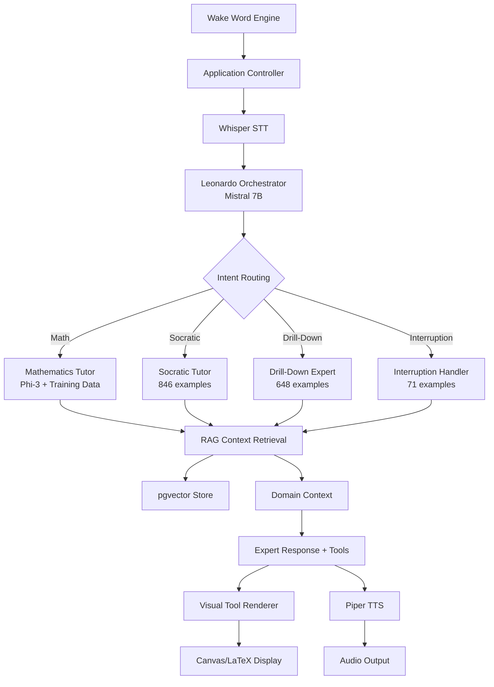

# Event-Driven Multi-Agent Architecture Integration
*Last Updated: August 30, 2025*

## System Overview: Our Implementation

This document maps the event-driven multi-agent architecture to our existing ZenGlow infrastructure, showing how our specialized training data and RAG system integrate seamlessly.

## Architecture Mapping: Specification → Implementation

### 🎯 Component Implementation Status

| Component | Specification | Our Implementation | Status |
|-----------|---------------|-------------------|---------|
| **Wake Word Engine** | Always-on activation | *Planned: Picovoice integration* | 🔄 Planned |
| **STT Service** | Speech transcription | ✅ **Whisper integration (Leonardo)** | ✅ Ready |
| **Application Controller** | Central orchestrator | ✅ **FastAPI + State Management** | ✅ Ready |
| **Orchestrator** | Intent routing | ✅ **Leonardo (Mistral 7B)** | ✅ Operational |
| **Expert Models** | Specialized tutors | ✅ **Fine-tuned specialists (training data ready)** | 🔄 Training |
| **Visual Renderer** | Tool display | ✅ **Frontend/Canvas integration** | ✅ Ready |
| **TTS Service** | Speech synthesis | ✅ **Piper TTS (British voice)** | ✅ Ready |

## Data Flow: Event-Driven Implementation



## Specialized Expert Integration

### 🎓 Mathematics Tutor (Our Training Data)
```json
{
  "action": "switch_expert",
  "target": "mathematics_tutor", 
  "tools": ["canvas", "latex", "graphing"],
  "context_sources": ["curriculum", "student_history", "mathematical_concepts"],
  "training_foundation": "500 pure methodology + 846 Socratic examples"
}
```

**Our Implementation:**
- **Base Training**: 500 pure methodology examples + 1,842 personality examples
- **Socratic Specialization**: 846 questioning examples for guided discovery
- **RAG Integration**: Mathematical concept retrieval + student history context
- **Tool Output**: Structured LaTeX/Canvas commands for visual rendering

### 🔍 Drill-Down Expert (Our Training Data)
```json
{
  "action": "switch_expert",
  "target": "drill_down_expert",
  "tools": ["text_emphasis", "concept_mapping"],
  "context_sources": ["memory", "definitions", "student_understanding"],
  "training_foundation": "648 drill-down questioning examples"
}
```

**Our Implementation:**
- **Training Data**: 648 intent-probing examples with progressive questioning
- **RAG Integration**: Definition retrieval + concept relationship mapping
- **Specialization**: Deep questioning patterns that reveal true understanding

### ⚡ Interruption Handler (Our Training Data)
```json
{
  "action": "handle_interruption",
  "target": "interruption_specialist",
  "tools": ["tts_control", "context_preservation"],
  "context_sources": ["interrupted_content", "student_question"],
  "training_foundation": "71 [USER_INTERRUPTION] examples"
}
```

**Our Implementation:**
- **Training Data**: 71 examples with `[USER_INTERRUPTION]` token integration
- **Technical Integration**: Application Controller TTS pause/resume
- **Context Preservation**: RAG retrieval of interrupted topic for graceful continuation

## Technical Implementation Details

### 🎛️ Application Controller Integration

**Our FastAPI Implementation:**
```python
# app/main.py - Event-driven state management
class ApplicationController:
    def __init__(self):
        self.active_expert = None
        self.session_state = {}
        self.audio_controller = AudioController()
        
    async def handle_user_input(self, text: str):
        # Route to Leonardo for intent detection
        routing_decision = await leonardo.route_intent(text)
        
        # Switch experts based on decision
        await self.switch_expert(routing_decision)
        
        # Get contextual response
        context = await rag.retrieve_context(text, self.active_expert.domain)
        response = await self.active_expert.generate(text, context)
        
        # Handle interruptions
        if "[USER_INTERRUPTION]" in text:
            await self.audio_controller.pause_tts()
            response = await self.handle_interruption(text, context)
            
        return response
```

### 🧠 Leonardo Orchestrator (Mistral 7B)

**Intent Routing Examples:**
```python
# Routing decisions from our Leonardo implementation
routing_examples = {
    "I need help with quadratic equations": {
        "action": "switch_expert",
        "target": "mathematics_tutor",
        "tools": ["latex", "graphing"],
        "confidence": 0.95
    },
    "I don't understand this concept": {
        "action": "switch_expert", 
        "target": "drill_down_expert",
        "tools": ["concept_mapping"],
        "confidence": 0.87
    },
    "Wait, hold on, what did you mean by...": {
        "action": "handle_interruption",
        "target": "interruption_specialist",
        "tools": ["tts_control"],
        "confidence": 0.92
    }
}
```

### 🎨 Visual Tool Integration

**Structured Output Processing:**
```python
# Our visual tool rendering pipeline
def process_expert_response(response):
    structured_output = parse_response(response)
    
    for element in structured_output:
        if element["type"] == "text":
            await tts_service.synthesize(element["content"])
        elif element["type"] == "latex":
            await visual_renderer.render_latex(element["content"])
        elif element["type"] == "graph":
            await visual_renderer.render_graph(element["data"])
        elif element["type"] == "canvas":
            await visual_renderer.draw_canvas(element["commands"])
```

## Interruption Handling: Our Complete Solution

### 🔧 Technical Layer (Application Controller)
```python
class InterruptionHandler:
    def __init__(self):
        self.vad = VoiceActivityDetector()
        self.tts_controller = TTSController()
        
    async def monitor_for_interruptions(self):
        while self.tts_controller.is_playing:
            if self.vad.detect_speech():
                await self.tts_controller.pause()
                user_input = await self.stt_service.capture()
                
                # Add interruption token for AI processing
                interrupted_input = f"[USER_INTERRUPTION] {user_input}"
                return interrupted_input
```

### 🤖 AI Training Layer (Our Training Data)
**Example from our 71 interruption training examples:**
```json
{
  "instruction": "The tutor is explaining algebra steps when student interrupts",
  "input": "First, isolate the variable by subtracting 3... [USER_INTERRUPTION] Why subtract first?",
  "output": "Excellent question! Let me pause and explain the reasoning...",
  "pedagogy_strategy": "interruption_clarification",
  "affect_focus": "confusion_resolution"
}
```

## Session Management Implementation

### 🎯 Explicit Session Ending
```python
# Our session management from training data
session_end_patterns = {
    "I'm done with math for today": {
        "action": "end_session",
        "response": "Great work today! You made excellent progress.",
        "cleanup": ["save_progress", "clear_canvas", "reset_state"]
    }
}
```

### 🔄 Implicit Topic Switching
```python
# From our session management training (6 examples)
topic_switch_patterns = {
    "Can you tell me a joke?": {
        "action": "switch_expert",
        "target": "general_conversationalist", 
        "tools": [],
        "transition": "I notice you'd like something lighter..."
    }
}
```

## Integration with Existing Infrastructure

### 🗄️ RAG Enhancement for Experts
```sql
-- Expert-specific context retrieval
SELECT chunk, embedding <-> $query AS dist
FROM doc_embeddings 
WHERE source IN ('memory', 'curriculum') 
  AND metadata->>'expert_domain' = $expert_type
  AND metadata->>'difficulty_level' <= $student_level
ORDER BY dist ASC LIMIT $k;
```

### 📊 Current Implementation Status

**✅ Ready Components:**
- Leonardo Orchestrator (Mistral 7B operational)
- TTS/STT Pipeline (Piper + Whisper)
- Visual Rendering Framework
- FastAPI Application Controller foundation
- Specialized Training Data (2,065 examples ready)
- RAG Context Retrieval System

**🔄 In Progress:**
- Expert Model Training (Phi-3 fine-tuning)
- Wake Word Engine Integration
- Advanced Interruption Detection
- Multi-modal Tool Coordination

**🎯 Next Implementation Steps:**
1. **Fine-tune Phi-3 models** using our specialized datasets
2. **Deploy expert routing** in Application Controller
3. **Integrate wake word detection** (Picovoice)
4. **Test end-to-end workflow** with real user interactions
5. **Performance optimization** and monitoring

## Workflow Example: Complete System

```
1. "Hey Sierra" → Wake Word Engine activates
2. "I need help with quadratic equations" → Whisper STT
3. Leonardo analyzes → {"action": "switch_expert", "target": "mathematics_tutor"}
4. App Controller loads Math Tutor + prepares Canvas tools
5. Math Tutor + RAG context → "How's your evening! Let's work on those quadratics..."
6. Structured output → [{"type": "text", "content": "..."}, {"type": "latex", "content": "x² + 2x = 8"}]
7. TTS speaks text + Visual renderer displays equation
8. User interrupts → [USER_INTERRUPTION] → Graceful handling
9. Session continues with expert responses + contextual knowledge
```

---

**This architecture perfectly leverages our existing infrastructure: specialized training data provides expert behaviors, RAG provides contextual knowledge, and the Application Controller orchestrates the complete multi-modal, interruption-aware tutoring experience.**
